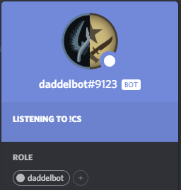
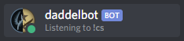
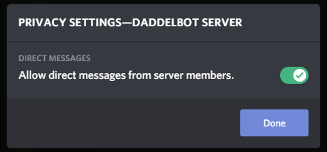
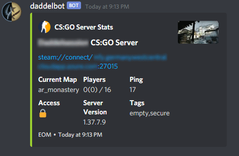
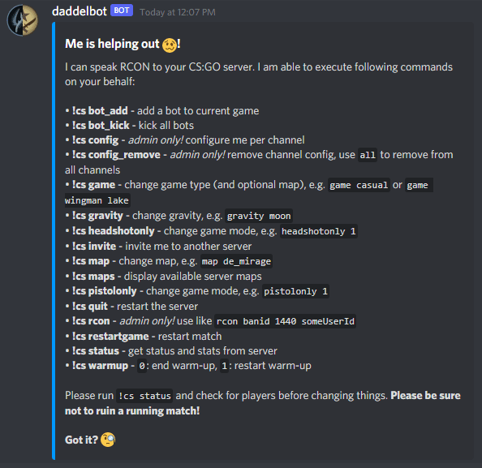
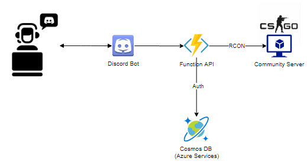

# Moin! I bims, daddelbot! 
This Discord bot helps users to send RCON commands to their CS:GO/SRCDS server. The bot gets configured per text channel, so you can use it for multiple CS:GO servers on a single Discord server.

## Discord Server Owners and Users

**BREAKING NEWS 2021-11: If you already have this bot running on your discord server, please repeat the invitation asap! Due to Discord API and permission changes the bot with the old permission settings is not able to post reactions... ¯\_(ツ)_/¯**

In order to use this bot the first thing to do is to invite it to your Discord server by following this [link](https://discord.com/oauth2/authorize?client_id=797866820996169779&permissions=93248&scope=bot):

Please leave the permissions as is. They are needed in order to make the bot work as expected.
After adding the bot to your server you should see it as a new user like this:  

Before you begin make sure that your server privacy settings allow users to send direct messages to each other! This is needed since the bot will ask you for your server credentials. In order to keep them secret this dialog is done using DM mode:  

You may switch this off again after channel configuration is done.

### Initial configuration

*HINT*  
If you do not want to provide your password due to reasons, the bot is still able to display a fancy status message of your server. All you have to configure is the address and the port of your server to get this:  

1. Go to the channel where the bot should serve your requests and send `!cs`
2. The initial configuration dialog should begin as a DM from the bot.
3. Answer all 4 questions.
4. The bot gives feedback when your settings are done.
5. *Optional:* remove all your answers from the DM dialog to keep them private.

Now that your bot is configured go back to that channel and type `!cs help` to get some basic information of what can be done:  

That's it. Have fun!

## Developers and Self-Hosters

If you want to use this bot privately for only your own CS:GO servers without the need of encrypting your passwords, I recommend using the predecessor of this project that can be found here:  
https://github.com/dichternebel/csgo-rcon-bot

If you want to run your own public version of this bot. Please have a look at this diagram showing an overview of the used infrastructure:  

If you want to dive deeper into my code, please have a look into the corresponding sub folder.  
There you'll find more information on that nerd stuff.